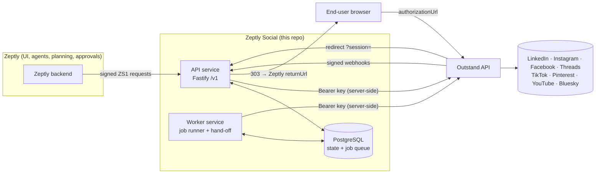
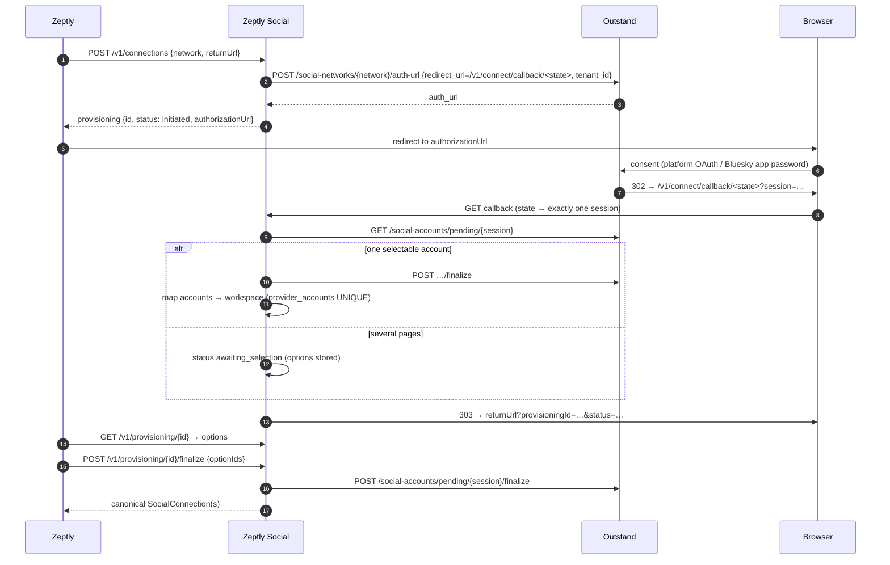
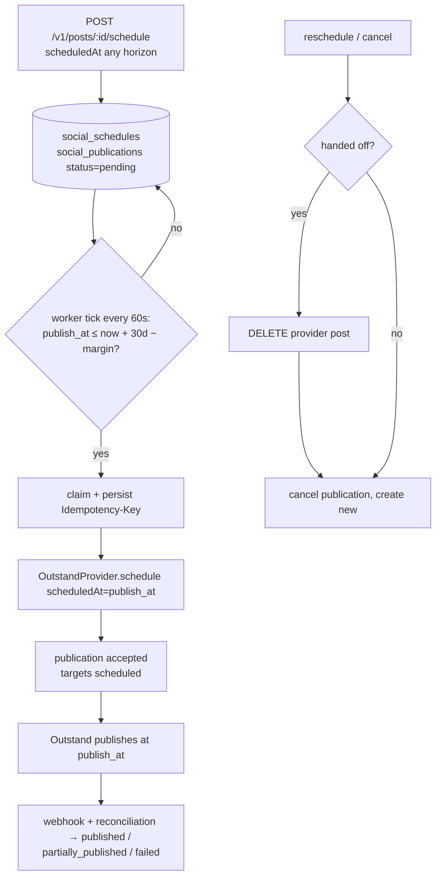
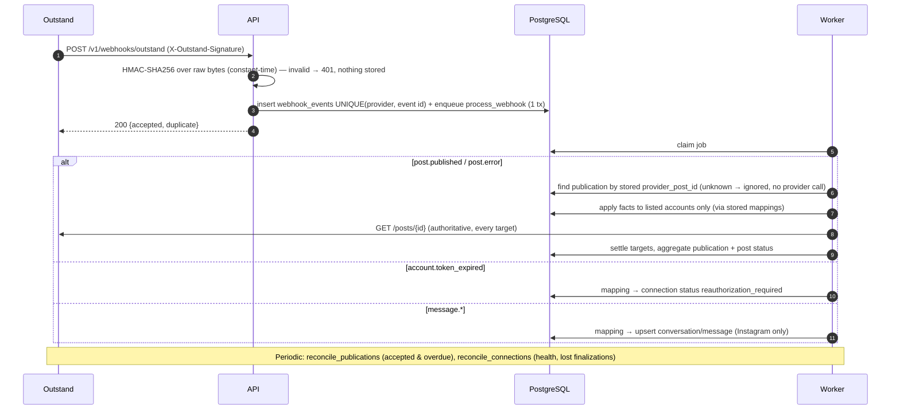
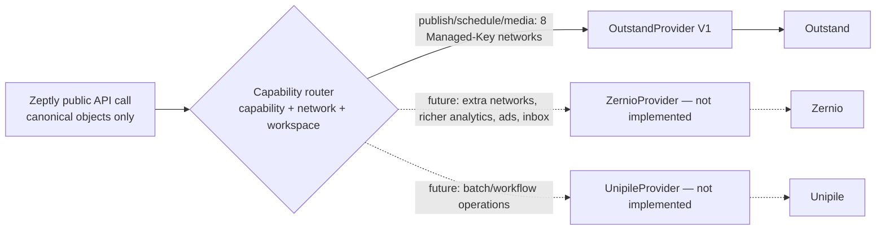

# Architecture

Zeptly Social is deliberately boring infrastructure. It has two Node.js processes, the **API** and the **Worker**. Both are built from one repository and one image, and they share one PostgreSQL database. PostgreSQL is the only coordination layer: there is no Redis and no message broker.

## Layers

| Layer | Package | Rule |
| --- | --- | --- |
| HTTP contract | `apps/api` | Zod-validated `/v1` routes; the only code that speaks HTTP to Zeptly |
| Canonical domain | `packages/domain` | `SocialConnection`, `SocialPost`, `SocialPostTarget`, `SocialPublication`, `SocialMedia`, `SocialConversation`, `SocialMessage`, `SocialMetric`, canonical errors |
| Application services | `packages/core` | Tenancy guards, provisioning, posts, dispatch queue, scheduling, webhooks, reconciliation, metrics, conversations, jobs, audit |
| Capability router | `packages/capability-registry` | (capability, network, workspace) → provider; versioned registry of verified capabilities/constraints |
| Provider contract | `packages/provider-contract` | `SocialProvider` interface + `ProviderError` |
| Provider adapter | `packages/provider-outstand` | Outstand transport, wire mapping, webhook verification |
| Persistence | `packages/database` | Drizzle schema + SQL migrations |

Provider identifiers stay in integration columns: `provider_accounts.external_id`, `social_publications.provider_post_id`, `social_media.provider_media_id` and `social_conversations.external_id`. They never leave through `packages/core/src/serializers.ts`, which is the only path from rows to public objects.

## 1. Overall system



## 2. Account provisioning

Outstand owns the OAuth callback for Managed-Key networks, so Zeptly never receives platform credentials. Ownership is proven by an unguessable **state token** embedded in the redirect URI. That token binds the browser return to exactly one provisioning session and so to one workspace. Outstand also receives an opaque per-workspace `tenant_id` (`zs_<random>`), never the Zeptly workspace id.



Bluesky offers two strategies. `provider_managed` uses the same hosted flow, where Outstand collects the app password. With `credentials`, Zeptly sends `{handle, appPassword}` once. The service forwards them to `POST /social-accounts/bluesky` and never stores or logs them.

## 3. Immediate publication

```mermaid
sequenceDiagram
  autonumber
  participant Z as Zeptly
  participant S as API
  participant DB as PostgreSQL
  participant O as Outstand
  Z->>S: POST /v1/posts (Idempotency-Key) {content, targets}
  S->>DB: validate targets ↔ workspace connections, constraints; insert draft
  Z->>S: POST /v1/posts/{id}/publish (Idempotency-Key)
  S->>DB: group targets → publications (queue entries), status queued
  S->>DB: claim (FOR UPDATE SKIP LOCKED) + persist provider Idempotency-Key (UUIDv4)
  S->>O: POST /posts/ {accounts:[provider ids], containers} + Idempotency-Key
  O-->>S: post {socialAccounts[]}
  S->>DB: compare requested vs returned accounts → missing = TARGET_DROPPED_BY_PROVIDER
  S-->>Z: 202 SocialPost (targets: publishing | failed)
  O-->>S: webhook post.published / post.error (later)
```

On a timeout or 5xx the publication moves to `retry_pending`. The worker retries it with the **same** key, so Outstand replays the original post and no duplicate is created.

## 4. Long-range scheduling (rolling hand-off)

Zeptly's schedule is canonical and is stored in `social_schedules`, with publications carrying `publish_at` in UTC. Outstand accepts `scheduledAt` at most `OUTSTAND_SCHEDULING_HORIZON_DAYS` (30) ahead. The worker hands a publication off once `publish_at ≤ now + horizon − OUTSTAND_HANDOFF_MARGIN_MINUTES`.



## 5. Webhook processing and reconciliation



## 6. Future multi-provider capability routing



Routing uses one `ProviderCapabilityTable` per provider, and resolution is first-match in table order. A workspace override can change that order, for example for a pilot. Operations on an existing resource use the provider that owns it (`social_connections.provider`), which keeps each connection's provider mapping stable. The router tests include a hypothetical second provider to show that routing changes need no API change.

## Data model (PostgreSQL)

| Table | Role |
| --- | --- |
| `workspaces` | External Zeptly workspace id + opaque provider tenant ref (nothing else) |
| `provisioning_sessions` | State-token-bound connection flows (hash of state, short-lived provider session handle) |
| `social_connections` | Canonical connection + status |
| `provider_accounts` | workspace → connection → provider account mapping; `UNIQUE(provider, external_id)` |
| `social_media` | Media references + provider media ids (no blobs) |
| `social_posts` / `social_post_targets` | Canonical post + per-connection target state; `UNIQUE(workspace_id, idempotency_key)` |
| `social_publications` | Provider submission per (network, content, options) group; doubles as dispatch queue |
| `social_schedules` | Canonical schedule (UTC + original timezone, revision) |
| `social_conversations` / `social_messages` | Provider-neutral DMs |
| `social_metrics` | Metric snapshots per target, network-scoped semantics |
| `provider_events` | Normalized provider-side state changes |
| `webhook_events` | Deduplicated receipts (redacted payload, hash, status, attempts, error) |
| `jobs` | Durable job queue (dedupe, bounded retries, dead letters) |
| `audit_events` | Audit trail (service + agent + request id) |
| `idempotency_keys` | API-level command idempotency |
| `worker_heartbeats` | Worker liveness |

Every tenant-owned table has a `workspace_id` foreign key. Status values are canonical strings validated by the domain schemas.
