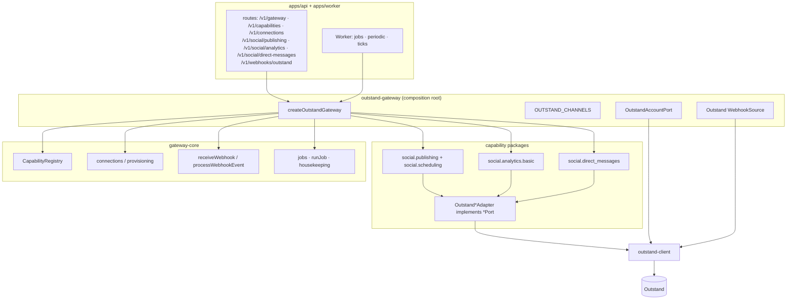
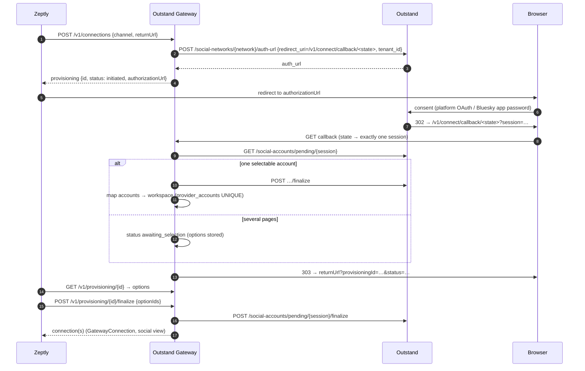
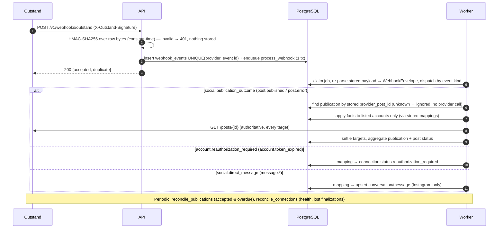
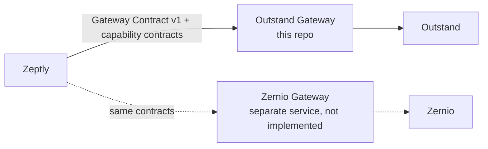

# Architecture

The Outstand Gateway is deliberately boring infrastructure. It has two Node.js processes, the **API** and the **Worker**. Both are built from one repository and one image, and they share one PostgreSQL database. PostgreSQL is the only coordination layer: there is no Redis and no message broker.

It is **one provider gateway**. The call path is:

```
Zeptly → Outstand Gateway → typed capability adapters → Outstand client → Outstand
```

There is no provider routing inside the gateway. The former "capability + network + workspace → provider" router was removed in the gateway refactor ([REFACTOR-REPORT.md](REFACTOR-REPORT.md)). A different provider is a different gateway implementing the same [Gateway Contract](GATEWAY-CONTRACT.md).

## Layers

| Layer | Package | Rule |
| --- | --- | --- |
| HTTP surface | `apps/api` | Zod-validated `/v1` routes; the only code that speaks HTTP to Zeptly. It registers a capability's routes only when that capability is composed |
| Gateway Contract v1 | `packages/gateway-contract` | Identity, workspace, provider reference, request context, idempotency key, capability descriptors, canonical errors, health, audit and webhook envelopes, connections and provisioning. Zod only; **no** social, inbox, SMS, broadcast or analytics domain |
| Gateway infrastructure | `packages/gateway-core` | Service auth, tenancy guards, account ownership, provisioning, idempotency, durable jobs and retries, webhook ingestion (`WebhookSource` → event-kind handlers), connection reconciliation, audit, `CapabilityRegistry` and discovery, error translation (`UpstreamError` → `GatewayError`). Imports no provider and no capability package |
| Capability contracts | `packages/adapters/*/src/contract*` | Social Publishing and Scheduling v1, Social Analytics v1, Social Direct Messages v1. Zod plus Gateway Contract only |
| Capability services | `packages/adapters/*/src/service` | Canonical domain logic over provider-neutral **ports** (`SocialPublishingPort`, `SocialAnalyticsPort`, `SocialDirectMessagesPort`) |
| Typed capability adapters | `packages/adapters/*/src/outstand` | Implement each port on the Outstand client. These are the only capability code that imports `@zeptly-gateway/outstand-client` |
| Provider client | `packages/outstand-client` | Outstand transport, auth, private wire schemas, typed sanitized results, `OutstandError extends UpstreamError`, rate-limit handling, webhook verification and parsing |
| Composition root | `packages/outstand-gateway` | Config, channel catalog, `OutstandAccountPort` (`ProviderAccountPort`), Outstand `WebhookSource`, capability composition, `Gateway` implementation |
| Persistence | `packages/database` | Drizzle schema + SQL migrations |

The static rules behind this table are enforced by `test/architecture.test.ts`.

Provider identifiers stay in integration columns:

- `provider_accounts.external_id`
- `social_publications.provider_post_id`
- `social_media.provider_media_id`
- `social_conversations.external_id`

The serializers of gateway-core and each capability package are the only path from rows to public objects, and none of them copies those columns.

## Gateway composition



Every capability is a `CapabilityModule`: a descriptor, the channels it runs on, and optionally jobs, periodic jobs, worker ticks, webhook event handlers and housekeeping. The registry turns the modules into:

- `GET /v1/gateway`, which lists the gateway's capabilities;
- `GET /v1/capabilities`, which reports availability per workspace. A capability is available when it is enabled and the workspace has an active connection on a supported channel;
- the worker plan.

Composing the gateway without a capability removes its routes, jobs and handlers, and leaves a coherent gateway. Architecture test A checks this.

Webhooks are verified and parsed by the Outstand `WebhookSource` into a `WebhookEnvelope` whose `event.kind` is provider-neutral:

| Kind | Handled by |
| --- | --- |
| `social.publication_outcome` | Social Publishing |
| `account.reauthorization_required` | Gateway core |
| `social.direct_message` | Direct Messages |
| `gateway.test`, `gateway.ignored` | Gateway core |

An envelope with no handler is stored and marked `ignored`.

## 1. Overall system


## 2. Account provisioning

Outstand owns the OAuth callback for Managed-Key networks, so Zeptly never receives platform credentials. Ownership is proven by an unguessable **state token** embedded in the redirect URI. That token binds the browser return to exactly one provisioning session and so to one workspace. Outstand also receives an opaque per-workspace `tenant_id` (`zs_<random>`), never the Zeptly workspace id.



Bluesky offers two strategies. `provider_managed` uses the same hosted flow, where Outstand collects the app password. With `credentials`, Zeptly sends `{handle, appPassword}` once. The service forwards them to `POST /social-accounts/bluesky` and never stores or logs them.

## 3. Immediate publication

```mermaid
sequenceDiagram
  autonumber
  participant Z as Zeptly
  participant S as API
  participant DB as PostgreSQL
  participant O as Outstand
  Z->>S: POST /v1/social/publishing/posts (Idempotency-Key) {content, targets}
  S->>DB: validate targets ↔ workspace connections, constraints; insert draft
  Z->>S: POST /v1/social/publishing/posts/{id}/publish (Idempotency-Key)
  S->>DB: group targets → publications (queue entries), status queued
  S->>DB: claim (FOR UPDATE SKIP LOCKED) + persist provider Idempotency-Key (UUIDv4)
  S->>O: SocialPublishingPort.publish → OutstandClient: POST /posts/ {accounts, containers} + Idempotency-Key
  O-->>S: post {socialAccounts[]}
  S->>DB: compare requested vs returned accounts → missing = TARGET_DROPPED_BY_PROVIDER
  S-->>Z: 202 SocialPost (targets: publishing | failed)
  O-->>S: webhook post.published / post.error (later)
```

On a timeout or 5xx the publication moves to `retry_pending`. The worker retries it with the **same** key, so Outstand replays the original post and no duplicate is created.

## 4. Long-range scheduling (rolling hand-off)

Zeptly's schedule is canonical and is stored in `social_schedules`, with publications carrying `publish_at` in UTC. Outstand accepts `scheduledAt` at most `OUTSTAND_SCHEDULING_HORIZON_DAYS` (30) ahead. The worker hands a publication off once `publish_at ≤ now + horizon − OUTSTAND_HANDOFF_MARGIN_MINUTES`.

```mermaid
flowchart TD
  A[POST /v1/social/publishing/posts/:id/schedule<br/>scheduledAt any horizon] --> B[(social_schedules<br/>social_publications status=pending)]
  B --> C{worker tick "handoff" every 60s:<br/>publish_at ≤ now + 30d − margin?}
  C -- no --> B
  C -- yes --> D[claim + persist Idempotency-Key]
  D --> E[SocialPublishingPort.schedule scheduledAt=publish_at<br/>Outstand adapter → client]
  E --> F[publication accepted<br/>targets scheduled]
  F --> G[Outstand publishes at publish_at]
  G --> H[webhook + reconciliation → published / partially_published / failed]
  A2[edit / reschedule / cancel] --> I{handed off?}
  I -- no --> K[cancel publication, create new]
  I -- yes --> U{edit/reschedule, update enabled,<br/>same targets, inside horizon?}
  U -- yes --> P[PATCH provider post in place<br/>same provider reference]
  U -- "no / PATCH failed / cancel" --> J[DELETE provider post] --> K
```

## 5. Webhook processing and reconciliation



## 6. More providers: more gateways, not routing



Zeptly asks each gateway `GET /v1/gateway` and `GET /v1/capabilities`, and decides which gateway serves a workspace or capability. Inside this gateway, the provider of every connection is fixed (`gateway_connections.provider = "outstand"`). The capability contracts are implementable by another gateway without changing their canonical domain; architecture test B proves this for Social Publishing. The report's recommendations for a Zernio Gateway are in [REFACTOR-REPORT.md](REFACTOR-REPORT.md#recommendations-for-a-future-zernio-gateway).

## Data model (PostgreSQL)

| Table | Role |
| --- | --- |
| `workspaces` | External Zeptly workspace id + opaque provider tenant ref (nothing else) |
| `provisioning_sessions` | State-token-bound connection flows (hash of state, short-lived provider session handle) |
| `gateway_connections` | Gateway connection + status (renamed from `social_connections` in migration 0001; a compatibility view keeps the old name for one release) |
| `provider_accounts` | workspace → gateway connection → Outstand provider account mapping; `UNIQUE(provider, external_id)` |
| `social_media` | Media references + provider media ids (no blobs) |
| `social_posts` / `social_post_targets` | Canonical post + per-connection target state; `UNIQUE(workspace_id, idempotency_key)` |
| `social_publications` | Provider submission per (network, content, options) group; doubles as dispatch queue |
| `social_schedules` | Canonical schedule (UTC + original timezone, revision) |
| `social_conversations` / `social_messages` | Provider-neutral DMs |
| `social_metrics` | Metric snapshots per target, network-scoped semantics |
| `provider_events` | Normalized provider-side state changes |
| `webhook_events` | Deduplicated receipts (redacted payload, hash, status, attempts, error) |
| `jobs` | Durable job queue (dedupe, bounded retries, dead letters) |
| `audit_events` | Audit trail (service + agent + request id) |
| `idempotency_keys` | API-level command idempotency |
| `worker_heartbeats` | Worker liveness |

Every tenant-owned table has a `workspace_id` foreign key. Status values are canonical strings validated by the contract schemas.

The `social_*` tables belong to the social capability packages but live in the same database and migration history: one PostgreSQL per gateway, with no per-capability database. Social Analytics reads the Social Publishing ledger (`social_publications`, `social_post_targets`) to know which provider posts to measure. This coupling is deliberate: "basic analytics" on this gateway means metrics of posts this gateway published.
